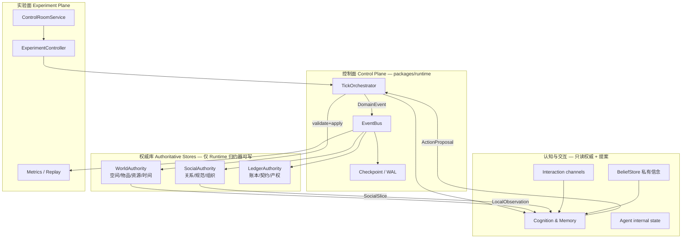
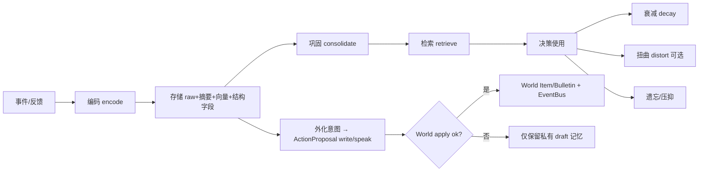
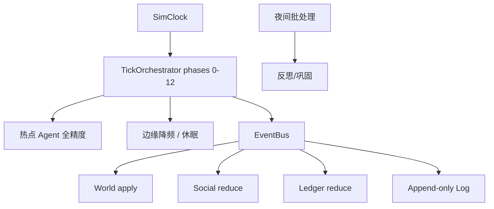
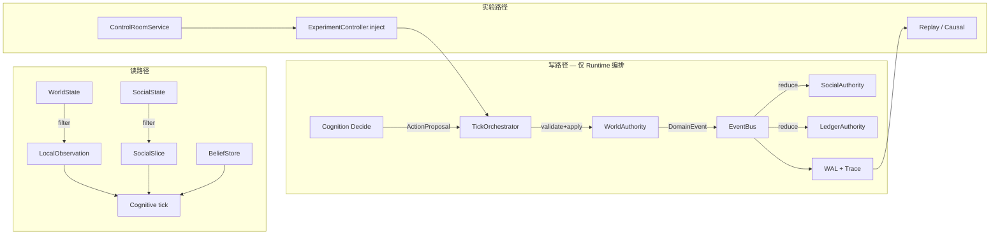

# 生成式社会模拟系统（Generative Social Simulator）总体设计蓝图

| 字段 | 值 |
|------|-----|
| **文档标题** | 多 Agent 持续运行社会实验平台 — 总体架构蓝图 |
| **作者** | Architecture Team / TBD |
| **日期** | 2026-07-10 |
| **修订** | 2026-07-10 Rev-2（补全 PersonModel / 情绪·具身 / 声誉·权力·冲突契约） |
| **状态** | Draft |
| **产品英文名** | Generative Social Simulator (GSS) |
| **范围** | 产品级设计契约（可增量实现）；非 demo 小镇特性设计 |
| **近程建设契约** | 阶段 A–F |
| **延期路线图** | 阶段 G–H |

---

## Overview

本文档定义一套**可长期运转、可注入变量、可观测涌现、可复现对比**的**生成式社会模拟系统（Generative Social Simulator）**总体架构。它不是短时聊天小镇 demo，而是面向研究者与实验者的**社会实验基础设施**：多个带状态的认知 Agent 在共享可演化世界中长期互动，从微观行为涌现出规范、阶层、舆论、合作/冲突与创新扩散等宏观结构；实验者可控制系统变量、断点续跑、回放因果、分叉对照。

架构以**八层分离**（World / Agent / Social / Institution & Economy / Cognition & Memory / Interaction / Runtime / Experiment & Observability）为骨架，以**分区权威（Partitioned Authority）+ Agent 永不持有权威写句柄**为第一不变量，以**结构化行动 + 自然语言表达**双轨为交互契约，以**认知循环与记忆生命周期**为个体灵魂，以**实验科学表面（种子、注入、分叉、指标、回放）**为产品差异化能力。阶段 A–F 构成可交付近程建设契约；阶段 G–H（文明代际、千人混同仿真）仅作路线图；§14 高级模块（司法全流程、媒体工业、宗教、科技树等）明确为**可扩展挂点**，非 day-one 范围。

**物理世界事实**由 `WorldAuthority` 独占；**社会图与账本事实**由 `SocialAuthority` / `LedgerAuthority` 作为 **DomainEvent 纯归约器**独占；Agent/Cognition 只产生提案、内部 patch 与 MemoryOp。完整字段级契约见 [附录 E：Contract Catalog](#附录-econtract-catalogpr-01-冻结集)。

---

## Background & Motivation

### 当前状态与痛点

现有「多 Agent 小镇 / 聊天围殴」类系统常见失败模式：

| 痛点 | 后果 |
|------|------|
| Agent = prompt + 向量库 | 人格崩坏、失忆、目标漂移失控 |
| 世界无权威 | LLM 幻觉直接改写事实，社会博弈崩溃 |
| 信息全局可见 | 无法形成欺骗、谣言、局部知识、权力 |
| 无结构化行动 | 无法校验前提/成本/可见性，不可复现 |
| 无实验科学层 | 好玩不可研究：无种子、无对照、无因果链 |
| 成本失控 | 无法断点续跑 30 天以上 |

### 为何需要本系统

社会科学、组织行为、制度设计与 AI 安全都需要**可控、可复现、可度量**的长期多智能体社会环境。本产品将「涌现」从叙事副产品升级为**可检验主张**，并以八条「真的在跑社会」评估标准作为完成度门槛（见 [评估标准](#十五评估怎样才算真的在跑社会)）。

### 产品边界

| 在范围内（A–F 契约） | 不在范围内（本蓝图非目标） |
|---------------------|---------------------------|
| 八层架构契约与关键接口 | 可执行模拟器代码 / 绑定具体 LLM 厂商 |
| 状态机式认知 Agent + 记忆生命周期 | Control Room 精美前端与动画 |
| 分区权威、局部观察、行动校验 | 论文式自动报告完整实现 |
| 关系/规范/资源/通信局部化 | G–H 全深度（人口代际、1000+ 混同） |
| 实验注入、种子、分叉、指标、回放 | 司法/宗教/科技树等 day-one 完备 |
| 运行时成本/检查点/故障隔离 | 30 天真实跑通实证（设计声明即可） |
| **E 媒体雏形**：多通道帖子 + 信念传播 + 简单声誉 | **§14.5 媒体工业**：记者 Agent、编辑方针、注意力市场 |

---

## Goals & Non-Goals

### 六大核心目标（first-class）

1. **长期一致性**：Agent 不轻易失忆、人格崩坏、目标漂移失控  
2. **社会涌现**：从微观互动涌现出宏观结构  
3. **可实验性**：可控制变量、可复现、可对比、可统计  
4. **可观测性**：过程透明，能量化，能回放  
5. **可持续运行**：成本可控、可断点续跑、可扩展规模  
6. **可介入性**：人类可扮演上帝、NPC、制度制定者或某个 Agent  

### 设计原则（first-class）

- **结构化行动 + 自然语言表达** 双轨  
- **认知分层**（反应 / 审议 / 反思 / 价值）  
- **世界状态权威（物理事实）+ 分区权威（社会/账本）**；Agent 只有局部观察，永不持有权威写句柄  
- **记忆可衰减、可扭曲、可社会化传播**  
- **一切重要过程可日志、可度量、可回放**  
- **实验优先于娱乐**（好玩是副产品，科学可控是主产品）  

### Non-Goals（建设期明确排除）

- 将整个 §14 高级清单当作 day-one 交付  
- 强制特定编程语言、LLM 供应商或 monorepo 布局  
- 以娱乐叙事导演取代实验可复现性  
- 允许 Agent/Cognition **直接**写任何权威库（World / Social / Ledger）  
- 将目标层级实现为完整 HTN 规划器（**KD-13**：A–F 用目标层级 + 反应路径替代；完整分层规划器延至 G）  

---

## Proposed Design

### 总体架构：八层（Eight Layers）

> **读图说明**：下图是**概念分层（abstraction stack）**，**不是** import/依赖图。规范依赖与写路径见 [跨层数据流](#跨层数据流控制面--数据面) 与 [分区权威](#分区权威partitioned-authority不变量)。



### 分区权威（Partitioned Authority）不变量

**真正的全局不变量不是「只有 World 能 mutate 任何东西」，而是：**

> **Agent / Cognition / Interaction 永不持有任何权威写句柄。**  
> 权威变更只能通过：(1) `WorldAuthority.validate+apply`；(2) Social/Ledger **纯函数归约**已校验 `DomainEvent`；(3) 带审计的 `Experiment` 注入（经由 Runtime 编排）。

| 权威分区 | 职责（独占写） | 写入触发 | 禁止 |
|----------|----------------|----------|------|
| **WorldAuthority** | 空间位置、物品存在性/位置、资源物理存量、时钟、天气、门禁可达性、世界可见实体（告示板、日记物品） | `applyAction` / 规则环境事件 / 实验 `injectEvent` | LLM 直接 mutate；Social 代码改位置 |
| **SocialAuthority** | 关系边、群体/组织成员、规范实例、声誉/地位缓存、冲突记录 | 归约 `relation.*` / `norm.*` / `org.*` 等 DomainEvent | Agent 直接改信任；LLM 重写整图 |
| **LedgerAuthority** | 账户余额、交易、产权登记、契约状态 | 归约 `economy.*` / `contract.*` DomainEvent | 认知层直接改余额 |
| **Agent internal** | 情绪、目标、自我叙事、ToM、**BeliefStore**、记忆 | `AgentInternalPatch` / `MemoryOp`（本 Agent 私有） | 写他者权威状态 |
| **Runtime** | 时钟游标、调度队列、成本计数、检查点元数据 | 编排器自身 | 发明社会/经济事实 |
| **Experiment** | 不直接写库；发布 `experiment.injected` 并由 Runtime 转为上述权威写 | ControlRoom / ExperimentController | 静默改世界无审计 |

**依赖图测试点（PR-01 起强制）：**

1. `packages/agent`、`packages/cognition` **不得** import 任何 `*Authority` 的可写实现（仅只读 port / DTO）。  
2. 仅 `packages/runtime` 的 event reducers（及经审计的 experiment inject path）可调用 `WorldAuthority.apply*` / `SocialAuthority.reduce` / `LedgerAuthority.reduce`。  
3. Cognition 可写：本 Agent `AgentState` 内部字段、`MemoryStore`、`BeliefStore`；可 **emit**：`ActionProposal`、`MemoryOp` 日志。  
4. 记忆**外化**（日记/发帖）必须走 `ActionProposal`，不得 Cognition→World 直写。

---

### 1. World Layer（世界层）

#### 职责

- 维护**物理/空间/资源** source of truth（分区权威之一，非「万物唯一写入口」）。  
- 对任意 `ActionProposal` 执行**合法性校验**与**后果结算**；拒绝幻觉写。  
- 按观察者位置/权限/通道生成 **LocalObservation**（严格局部化信息）。  
- 驱动环境事件（日常 / 社会脚本触发器 / 冲击 / 实验注入）。  
- 成功外化行动创建世界可见实体（`Item` 日记、`Bulletin` 告示、可被 observe 的 `Message` 残留）。

#### 主要实体与状态

```
WorldState {
  world_id, seed, tick, calendar  // 多层时间
  regions[], places[], rooms[], cells?  // 区域→地点→房间→坐标
  entities: Item | Building | ResourcePool | Bulletin
  ownership: map EntityId → OwnerRef   // 镜像；规范源在 Ledger（阶段 C 起双写一致性由 Runtime 保证）
  access_control: doors, invites, visibility_class
  weather, environment_params
  event_log_head
  ruleset_id
}
```

**空间**：区域 → 地点 → 房间 → 坐标/格子；私密性等级见 `VisibilityClass`；功能标签（住宅、市场、农场、工坊、学校、广场、庙宇、市政厅、媒体中心…）。空间功能调制行为先验。

**物品与资源**：可携带/消耗/损坏/交易/制造；类型含食物、材料、能源、信息、注意力、土地。**稀缺性**是冲突与制度起源的核心燃料。

**时间**：秒/分钟（行动）、小时（日程）、天（周期）、季/年（宏观）；支持研究模式加速。

**事件**：日常、社会、冲击、实验注入。

**规则引擎**：物理/逻辑（不能无中生有）优先；制度参数由 Institution 提供只读视图给校验器。

#### 接口契约（字段见附录 E）

```typescript
interface WorldAuthority {
  getSnapshot(at?: Tick): WorldState;
  observe(agentId: AgentId, opts?: ObserveOpts): LocalObservation;
  validateAction(proposal: ActionProposal): ValidationResult;
  /** 原子：校验快照 + 应用；失败不改状态。同 tick 内串行调用（见并发节） */
  applyAction(proposal: ActionProposal): ActionResult;
  injectEvent(event: WorldEvent, source: EventSource): void;
  queryFacts(filter: FactQuery): Fact[]; // 实验/调试；Agent 不直用
}
```

**ActionProposal 单源结构（消除字段重复）：**

```typescript
interface ActionProposal {
  id: ActionId;
  actor: AgentId;
  action: StructuredAction;  // 唯一的 verb/visibility/cost 来源
  utterance?: string;        // 自然语言轨道；不绕过 precondition
  tickProposed: Tick;
}

interface StructuredAction {
  verb: ActionType;
  objectIds?: EntityId[];
  targetAgentIds?: AgentId[];
  params: Record<string, number | string | boolean>;
  preconditions: Precondition[];
  cost: ResourceCost;
  duration: Duration;
  successRateModifiers: Modifier[];
  visibility: VisibilityClass;
  consequenceTemplateId: string;
}
```

`validateAction` **规范化**：忽略任何历史双字段；仅读 `action.*`。

#### 不变量与失败模式

| 不变量 | 失败模式 | 缓解 |
|--------|----------|------|
| 仅 `applyAction` / 环境规则改写 WorldState | LLM 输出直接 mutate | Agent 无写句柄 |
| 观察严格局部 | 全局广播导致谣言失效 | PerceptionFilter + 通道权限 |
| 行动前提/成本/互斥可检验 | 同 tick 抢同一物品 | 串行 apply + 资源锁 |
| 外化必须经 ActionProposal | Cognition 直写 Bulletin | 依赖图测试 + API 不暴露 |

**阶段归属**：C 起核心可用；A 可用最小「单房间世界」替身。

---

### 2. Agent Layer（Agent 层）

#### 职责

- 将每个 Agent 建模为**带状态的认知实体**（非 prompt+vectorstore only）。  
- 持有身份/人格/**自我叙事（Self-Narrative）**、多层需求、分层目标、技能、情绪生理、具身约束、元认知。  
- 向 Cognition 提供可读写的**个体内部**状态；向 Runtime 只提交 `ActionProposal`。

#### 主要实体与状态

```
AgentState {
  identity: StaticIdentity
  personality: PersonalityProfile   // Big Five、道德基础、风险/时间/权力/成就/亲和
  selfNarrative: SelfNarrative      // Self-Narrative：我是谁 / 想成为谁 / 害怕成为谁
  masks: RoleMask[]
  needs: NeedVector
  goals: GoalHierarchy
  skills: SkillSet
  emotion: EmotionState
  physiology: PhysiologyState
  body: Embodiment                  // 位置为 World 镜像只读缓存
  metaCognition: SelfModel
  decisionStyle: DecisionStyle      // 见下表 phase
  lifecycle: 'active' | 'retired' | 'dead'
  cognitiveBudget: TokenQuota
}
```

**需求引擎**：行为驱动力 ≈ `需求压力 × 机会 × 人格 × 规范约束 × 预期结果`。

**目标层级与冲突**：

| 层 | 时间尺度 | 示例 |
|----|----------|------|
| Life Ambition | 终身 | 成为受人尊敬的工匠 |
| Stage | 月/季 | 攒够开铺本金 |
| Daily | 日 | 完成三件订单 |
| Intent | 5–30 min | 去市场买木材 |
| Emergency | 插入 | 灭火 / 应邀 |

目标属性：优先级、截止、进度、成功标准、放弃条件、来源（`self` / `request` / `institution` / `experiment_inject`）。冲突仲裁：紧急威胁 > 制度强制 > 高权重需求 > 身份一致性 > 默认满意化。

**决策风格 `DecisionStyle`（phase 标签）：**

| 风格 | 最小行为 | 阶段 |
|------|----------|------|
| `satisficing`（默认） | 选第一个超过阈值的选项 | **A** |
| `utility_max` | 对选项打分取 max | B+ |
| `habit` | 高 procedural 记忆直接触发 | B+ |
| `affective_impulse` | 情绪幅度超阈跳过审议 | B+ |
| `rule_follower` | 优先制度/规范允许集 | D+ |
| `opportunist` | 短期收益加权 | E+ |

**技能学习（最小契约）：** 成功行动 → `skill.xp += f(difficulty)`；长期不用 → 慢衰减。完整遗忘曲线与教学系统 → **G / §14.3**。A 仅静态技能表 + xp 计数即可。

**分层规划：** A–F **不**实现独立 HTN Planner；战略/战术/操作/反应映射到目标层级四层 + Emergency 插入（**KD-13**）。完整 `Planner` 接口延期 G。

**多 Agent 协调（最小 / phase）：**

| 能力 | 最小状态/行动 | 阶段 |
|------|---------------|------|
| 约会/共同计划 | `Goal` 共享 `jointGoalId` + 双方 Prospective 记忆 | **B** |
| 分工 | 组织 `role` 分配（无完整项目管理） | **D** |
| 会议/投票 | `ActionType.vote` + org decisionProcedure | **D** |
| 联盟/背叛 | relation + 承诺违约路径 | **B–D** |

**情绪、生理、具身、元认知（显式机制，非「同前」占位）：**

```typescript
/** [Freeze] 基础 + 复合情绪维度；值域通常 clamp 到 [-1,1] 或 [0,1] */
interface EmotionState {
  joy: number; anger: number; sadness: number; fear: number;
  surprise: number; disgust: number; trust: number;
  // 复合（由基础推演或事件直接写入）
  jealousy: number; guilt: number; pride: number; shame: number; nostalgia: number;
}

/** [Freeze] 生理驱动可用认知资源与行动可行性 */
interface PhysiologyState {
  energy: number;      // 0..1 疲劳反相关
  hunger: number;      // 0..1 高=饥饿压力
  fatigue: number;     // 0..1
  stress: number;      // 0..1
  health: number;      // 0..1
  arousal: number;     // 0..1 兴奋/警觉
  sleepDebt: number;   // 累计欠睡（tick 或小时当量）
}

/** [Freeze] 具身约束；位置以 World 为准，body 为只读镜像缓存 */
interface Embodiment {
  placeId: PlaceId;            // 镜像 World.entity.place
  moveSpeed: number;           // 格/tick 或 place hops
  carryCapacity: number;       // 负重上限
  carriedMass: number;
  senseRange: { vision: number; hearing: number }; // 观察半径（World.observe 用）
  actionMutex: ActionMutexSlot[]; // 当前占用槽：'locomotion'|'manual'|'speech'|'rest' 等
  injuryFlags: string[];
}

/** [Freeze] 元认知 / 自我模型（缓慢更新） */
interface SelfModel {
  perceivedStrengths: string[];
  perceivedWeaknesses: string[];
  estimatedOthersViewOfMe: Record<AgentId, number>; // 粗粒度「别人怎么看我」
  valueAlignmentScore: number;  // 近期行为与价值观一致性 0..1
  recentFailureStreak: number;
  lastLifeReviewTick: Tick;
}
```

**情绪 → 系统效应（Feel / Encode / Deliberate 强制读取）：**

| 效应 | 规则（最小可实现） |
|------|-------------------|
| 记忆编码强度 | `importance' = importance * (1 + α * max(\|emotion\|))`，α 默认 0.3 |
| 风险决策 | `fear`/`stress` 高 → 高风险选项 score × (1−β)；`anger` 高 → 对抗选项 score × (1+γ) |
| 对话语气 | `ActionProposal.utterance` 生成 prompt 注入 dominant emotion 标签（不改 World） |
| 社交接近/回避 | `trust`↓ 或 `fear`↑ → 对特定 other 的 `move`/`speak` 接近选项降权 |

**生理驱动：** 每 tick 自然漂移（饥饿↑、疲劳↑若未 rest）；`energy`/`health` 过低限制 `CognitiveBudget` 与高难度行动成功率；`sleepDebt` 达阈触发强制 rest 倾向。睡眠/rest 阶段触发 Memory consolidate。

**具身与互斥：**

- `WorldAuthority.validate` 检查：同 tick 不得占用冲突 `actionMutex`（如 `rest` ∩ `speak` → `MUTEX`）；`carriedMass > carryCapacity` → `PRECONDITION`；目标 place 超出 `moveSpeed` 可达 → 拒绝或拆步。  
- 可见/听力范围由 `senseRange` + 空间私密性共同决定 `LocalObservation` 内容。  
- 受伤/生病：`health` 衰减 + `injuryFlags`；死亡/退休见 `lifecycle`（历史状态保留）。

**元认知周期：** 日常/人生反思后可写 `AgentInternalPatch` 微调 `selfNarrative`、小幅 `personality`（硬上限）、重置 `recentFailureStreak`；**禁止**单次反思大幅改人格。

#### 接口

```typescript
interface AgentRuntimeView {
  getState(id: AgentId): AgentState;
  updateInternal(id: AgentId, patch: AgentInternalPatch, cause: CauseRef): void;
}

interface CognitiveTickInput {
  agentId: AgentId;
  observation: LocalObservation;
  socialContext: SocialSlice;
  clock: SimClock;
  budget: CognitiveBudget;
}

interface CognitiveTickOutput {
  action?: ActionProposal;
  internalUpdates: AgentInternalPatch;
  memoryOps: MemoryOp[];
  decisionTrace: DecisionTrace;
  tokensUsed: number;
}
```

#### 不变量

- 人格日漂移有硬上限。  
- 实验注入目标/人格变更写审计日志。  
- 死亡/退休不删除历史。  
- `goal_rewrite` / `possess` **不**直接改 World 事实；仅改 Agent 内部或注入消息/事件种类。

**阶段归属**：A 核心（含 N 日续跑出口，见路线图）。

---

### 3. Social Layer（社会层）

#### 职责

- 作为 **SocialAuthority** 维护关系网络、群体/组织、规范与文化模因、声誉与地位、权力、冲突。  
- 仅通过 EventBus 归约更新；从互动**涌现**描述性规范（支撑评估 #2）。

#### 主要实体

```
RelationEdge { a, b, dimensions, type, publicFacade, privateReality, history[] }
Group | Organization { goals, members, roles, hierarchy, resources, norms, decisionProcedure, orgMemory }
ReputationProfile, StatusVector, PowerHoldings, SocialConflict
```

#### 声誉 / 地位 / 权力 / 冲突（状态 + 归约规则）

```typescript
/** [Freeze] 多维声誉；可按圈子 scope 分桶 */
interface ReputationProfile {
  subject: AgentId;
  scope: { groupId?: GroupId; placeId?: PlaceId } | 'global';
  dimensions: {
    reliability: number;  // 可靠
    generosity: number;   // 慷慨
    competence: number;   // 专业
    danger: number;       // 危险
    interesting: number;  // 有趣
  }; // 各维建议 clamp [-1,1] 或 [0,1]
  lastUpdated: Tick;
}

/** [Freeze] 地位：话语权与资源获取加权 */
interface StatusVector {
  subject: AgentId;
  wealth: number;        // 来自 Ledger 镜像或周期采样
  force: number;         // 武力/胁迫能力（制度允许时）
  knowledge: number;     // 技能/信息中心性代理
  charisma: number;      // 来自互动成功与声誉
  networkCentrality: number; // 图度量（Runtime 批算）
  office: number;        // 正式职位权重
  /** 综合地位分：可配置加权和，供发言权/分配优先 */
  composite: number;
}

/** [Freeze] 正式 + 非正式权力 */
interface PowerHoldings {
  subject: AgentId;
  formal: Array<{
    kind: 'office' | 'property' | 'enforcement';
    refId: string;       // org role / propertyId / mandateId
    strength: number;
  }>;
  informal: Array<{
    kind: 'opinion_leader' | 'elder' | 'coercer';
    strength: number;
    evidence: EventRef[];
  }>;
}

/** [Freeze] 社会冲突实例（评估 #7 因果链根对象之一） */
type ConflictKind = 'resource' | 'value' | 'identity' | 'misunderstanding' | 'structural';
type ConflictStage =
  | 'dispute' | 'opposition' | 'alliance_forming'
  | 'sanction' | 'violence' | 'mediated' | 'resolved' | 'cold';

interface SocialConflict {
  id: ConflictId;
  kind: ConflictKind;
  stage: ConflictStage;
  parties: AgentId[];
  stakes: string;                 // 资源/规范/身份摘要
  relatedNormIds: NormId[];
  relatedContractIds?: string[];
  eventChain: EventRef[];         // 证据链（因果追溯）
  openedAt: Tick;
  closedAt?: Tick;
  mediatorId?: AgentId;
}
```

**SocialAuthority.reduce 对声誉/权力/冲突的最小规则：**

| 事件 | 归约效果 |
|------|----------|
| `action.applied` 且成功完成承诺/交易 | 当事人 `reliability`/`generosity` +ε（scope=互动场所或群体） |
| `action.applied` 违约 / `contract.changed(breached)` | 违约方 `reliability` −δ；可选开启或升级 `SocialConflict` |
| `norm.violation` | 观察者对行动者 `relation` 微调；行动者局部 `reputation` −；Phase D 可进入 `sanction` 阶段 |
| `relation.changed` | 更新边；若 `rivalry`/`fear` 超阈且双方有资源争议 → spawn/升级 `SocialConflict` |
| `economy.transfer` 大额赠与 | `generosity`↑；`StatusVector.wealth` 周期重算 |
| 组织 `role` 任命/罢免（DomainEvent 扩展或 `institution.*`） | 更新 `PowerHoldings.formal` 与 `StatusVector.office` |
| 调解成功 / 审判（D+） | `stage→mediated/resolved`，写 `eventChain` |

**冲突升级链（默认，可用 Ethics 关闭暴力）：**  
`dispute → opposition → alliance_forming → sanction → (optional) violence → mediated|resolved|cold`。  
升级条件：重复负向互动计数、公共品搭便车曝光、资源互斥失败次数。Runtime **不**自动跳阶段；由事件归约或显式 `ActionType.sanction` / `mediate` 推动。

**地位影响：** Deliberate 对公共 `speak`/`vote` 选项可加 `statusWeight`；Ledger 分配/优先队列可读 `StatusVector.composite`（制度参数可关）。**非正式权力**不自动改 World 产权，只影响选项分与规范制裁成功率。

**SocialSlice 扩展（局部可见，非全图）：** 除关系与规范外，可含 `myReputation`、自身 `StatusVector` 摘要、与我相关的 `openConflicts[]`（id+stage+parties）。

#### 规范涌现机制（可实现最小集，阶段 B 计数 / D 制裁）

```typescript
interface NormObservationCounter {
  scope: { groupId?: GroupId; placeId?: PlaceId };
  actionType: ActionType;
  windowTicks: number;          // 默认 3 模拟日换算 tick
  count: number;
  uniqueActors: number;
}

// 晋升规则（phase B 启用计数；达阈生成 Norm）
// IF count >= T_freq AND uniqueActors >= T_actors within window
// THEN spawn Norm{ kind:'descriptive', strength: clamp(count/window), origin:'emergent', ... }
// T_freq 默认 5，T_actors 默认 2（3–8 人 vignette 可标定）

interface Norm {
  id: NormId;
  kind: 'descriptive' | 'injunctive' | 'taboo' | 'etiquette';
  scope: NormScope;
  strength: number;             // 0..1
  sanctions: SanctionType[];    // phase D: mock|exclude|retaliate|accuse
  origin: 'emergent' | 'institutional' | 'injected';
  evidence: NormObservationCounter;
  createdAt: Tick;
}
```

**违反处理：**

1. Observer 目击 `action.applied` 与活跃 descriptive/injunctive norm 冲突 → 发出 `norm.violation` 事件。  
2. SocialAuthority 更新观察者对行动者的 `relation`/`reputation`（小幅）。  
3. Phase D：解锁 `ActionType.sanction`；未解锁前仅态度变化。  

**指标：** `emergent_norm_count = count(norms where origin=='emergent')`（**排除** `injected|institutional`）。评估 #2 fixture 断言该计数在无剧本注入下 > 0（小场景种子集）。

#### 不变量

- 禁止 LLM 直接重写关系图。  
- `origin` 字段不可被涌现路径写成 `injected`。  
- 和平是动态均衡，非默认。

**阶段归属**：B（关系/承诺/计数器）→ D（组织/制裁/指令性规范）→ E（声誉多维与圈层）。

---

### 4. Institution & Economy（制度与经济层）

#### 职责

- **LedgerAuthority** 维护货币/市场（可选）、产权、职业、税收、契约状态。  
- 将制度旋钮 `InstitutionParams` 暴露给 Experiment。  
- 结算生产、交易、违约；执行路径：制度 vs 私人报复（事件化）。

#### 主要实体

```
Ledger, PropertyRights, Contract, Market, PublicGood, InstitutionParams, Occupation, Stratum
```

经济闭环：生产 → 分配 → 消费。公共品是集体行动黄金实验床。

#### 不变量

- 余额/产权变更必须账本化。  
- 制度参数变更 = 实验事件 + 前后快照。  
- Ledger 只经 `reduce(DomainEvent)`，无 LLM 路径。

**阶段归属**：C 基础产权生产 → D 公共品/职位 → E 市场契约税收。

---

### 5. Cognition & Memory（认知与记忆层）— 系统灵魂

#### 职责

- 多阶段**认知循环**与七类记忆生命周期。  
- 分层反思、洞见、Theory of Mind、睡眠巩固。  
- **BeliefStore** 私有信念（与 World 事实可冲突）；Deliberate 读信念影响选项分。  
- 外化意图 → 仅生成 `ActionProposal`，成功后由 World 创建可见实体。

#### 记忆类型

| 类型 | 内容 | 长期一致性角色 |
|------|------|----------------|
| Episodic | 何时何地与谁 | 事件证据 |
| Semantic | 世界知识、规则摘要 | 稳定信念原料 |
| Procedural | 技能脚本 | 习惯 |
| Social | 承诺、恩怨、人情账 | **债务/承诺**（评估 #1） |
| Self | 自传、转折点 | 身份连续 |
| Prospective | 答应将做之事 | 预约与信任 |
| Collective | 群体共享叙事 | 文化（D+ 写入 orgMemory） |

#### 记忆生命周期



**外化规则（强制）：** 日记、发帖、建档 = `ActionType.write` / `speak` / `post` 的 `ActionProposal`。成功 → World 实体 + 可选 `message.posted`；失败 → 仅私有 draft，**禁止** Cognition 调用 World 写 API。

#### 认知循环（11 阶段）

1. Perceive 2. Attend 3. Interpret 4. Retrieve 5. Feel 6. Deliberate 7. Decide 8. Act 9. Feedback 10. Reflect 11. Reconsolidate  

**信念 vs 观察冲突：** Deliberate 输入同时含 `LocalObservation` 与 `BeliefStore`。若信念命题与观察矛盾：默认 **观察优先于低 confidence 信念**；高 confidence 信念（>θ，默认 0.7）可保留并产生「怀疑/调查」选项。选项得分加入 `beliefBias` 项（谣言影响集体决策的入口，评估 #4）。

#### Theory of Mind（`PersonModel`）— 显式契约

每个 Agent 对**重要他人**维护独立心智模型（非全局真相；可错、可旧、可被谣言污染）。检查点必须序列化全量 `PersonModel[]`。

```typescript
/** [Freeze] 我对 target 的心智模型（存于 Cognition，非 SocialAuthority） */
interface PersonModel {
  owner: AgentId;                 // 建模者
  target: AgentId;                // 被建模者
  traitEstimate: Partial<PersonalityProfile>; // 对方是什么样的人
  likes: string[];                // 对方喜欢/追求
  fears: string[];                // 对方害怕
  attitudeTowardMe: {             // 对方对我的态度（我的估计）
    affinity: number; trust: number; respect: number; fear: number;
  };
  knowledgeAttribution: Array<{   // 对方可能知道什么（知识归属）
    proposition: Proposition;
    confidenceTheyKnow: number;   // 0..1
    lastEvidenceTick: Tick;
  }>;
  predictedNextAction?: {         // 对方可能下一步做什么
    actionType?: ActionType;
    summary: string;
    confidence: number;
  };
  relationshipHypothesis: string; // 公开/私下关系的自然语言摘要
  lastUpdated: Tick;
  updateCount: number;
  saliency: number;               // 重要性；低 saliency 可降频更新
}

interface PersonModelStore {
  get(owner: AgentId, target: AgentId): PersonModel | undefined;
  upsert(model: PersonModel, cause: CauseRef): void;
  listImportant(owner: AgentId, k: number): PersonModel[];
}
```

**更新规则（Reconsolidate / 关系反思 / Feedback）：**

1. **直接互动**：收到 `message.delivered` / 共同 `action.applied` → 用结果与语气更新 `attitudeTowardMe` 与 `traitEstimate`（EMA：`new = (1−λ)*old + λ*obs`，λ 默认 0.2）。  
2. **第三方叙述**：`Belief` source=`told_by` 且命题涉及 target → 仅以 `confidence * sourceTrust` 弱更新；**不**写 World。  
3. **预测校验**：若 `predictedNextAction` 与后续观察一致 → `confidence`↑；不一致 →↓ 并编码 episodic「误判」。  
4. **衰减**：`saliency` 低且 `now - lastUpdated > T_stale` → 细节模糊（清空 `predictedNextAction`，降低 trait 精度），写 `MemoryOp.distort` 可选。  
5. **检索使用**：Deliberate 对涉及 `other` 的选项，读取 `PersonModel` 调整合作/欺骗/回避分；DecisionTrace **必须**记录所用模型。

**分层反思 → Insight：**

| 层 | 触发 | 产出 |
|----|------|------|
| 微观 | 每次对话后（可抽样） | 语气/策略洞见 |
| 日常 | 日界 | 目标进度、情绪摘要 |
| 关系 | 与某 target 互动积累或违约 | **更新 PersonModel** + 关系 Insight |
| 人生 | 阶段目标完成/失败 streak | selfNarrative / 志向重写候选 |
| 社会 | 规范/组织事件 | 社会规矩洞见 |

`Insight` 作为可检索记忆（kind 可映射 semantic/self），供未来 Retrieve。

#### 认知 tick 接口

```typescript
interface CognitiveEngine {
  tick(input: CognitiveTickInput): Promise<CognitiveTickOutput>;
}

interface DecisionTrace {
  agentId: AgentId;
  tick: Tick;
  attended: Signal[];
  retrievedMemoryIds: MemoryId[];
  beliefsUsed: BeliefId[];
  /** ToM：本 tick 读入的他人模型（评估 #7 因果链需要） */
  personModelsUsed: Array<{ target: AgentId; fields: string[] }>;
  emotionSnapshot: Partial<EmotionState>;
  physiologySnapshot: Partial<PhysiologyState>;
  dominantNeeds: NeedId[];
  goalsConsidered: GoalId[];
  options: { action: StructuredAction; score: number; rejectReason?: string }[];
  chosen?: ActionId;
  reflectionInsightsUsed: InsightId[];
  modelTier: 'reactive' | 'deliberative' | 'deep';
}
```

#### 不变量

- Social/Prospective 承诺重要性地板值。  
- 检查点含 MemoryStore + **PersonModelStore** + BeliefStore + Emotion/Physiology。  
- 扭曲/衰减写 `MemoryOp` 日志。  
- `PersonModel` **不是** Social 关系图的副本：SocialAuthority 持有双边权威边；PersonModel 是单边主观估计，允许与 `RelationEdge` 不一致（表面和气 / 误判的来源）。

**阶段归属**：A 核心闭环；B 强化社会/前瞻记忆与二元信念；E 谣言拓扑。

---

### 6. Interaction（交互与通信层）

#### 职责

- 多通道通信与策略性语言；结构化行动提交。  
- **信息局部化**；**Belief / 谣言**最小模型（评估 #4）。  
- 对话服务社会功能，非闲聊为主。

#### 通道与局部化

| 通道 | 约束 | 阶段 |
|------|------|------|
| 面对面 | 距离 + 同房间 + 私密性 | B |
| 私信/信件 | 寻址 | B |
| 演讲/海报/简易帖子 | 可见性范围与衰减 | **E 媒体雏形** |
| 记者/编辑/注意力市场 | — | **§14.5 延期** |
| 非语言 | 礼物、仪式 → 结构化行动 | B–D |

#### 信念 / 谣言最小 schema（阶段 B 起）

```typescript
interface Belief {
  id: BeliefId;
  owner: AgentId;                 // 私有，非 World 事实
  proposition: Proposition;       // 结构化：{ pred, args, polarity }
  confidence: number;             // 0..1
  source: BeliefSource;           // observed | told_by | inferred | injected
  sourceAgentId?: AgentId;
  evidenceRefs: EventRef[];
  lastUpdate: Tick;
  verified: boolean;              // verify 行动成功后 true
}

interface BeliefStore {
  get(owner: AgentId, filter?: BeliefFilter): Belief[];
  upsert(belief: Belief): void;   // 仅 Cognition/Interaction onMessage 路径
}

// 传播概率（接收时）
// P(accept) = novelty * emotionality * sourceTrust * (1 - verifyCostPressure)
// phase B: dyadic tell/lie → 接收方 BeliefStore
// phase E: multi-hop rumor along relation edges + public post channel
```

**更新规则：**

| 事件 | 规则 |
|------|------|
| 收到 assert 消息 | 以 `P(accept)` 写入/上调 confidence；拒绝则忽略或记「不可信来源」 |
| 直接 observe 矛盾 | 下调或翻转信念；confidence←max(observeConfidence) |
| `ActionType.verify` 成功 | `verified=true`，confidence→高 |
| 谎言 | **不**改 World；只改接收方 Belief |

**Worked example（附录 C-bis）：** 假谣言「东田有毒」→ 多种子 Agent confidence 上升 → 集体拒绝 `harvest` 选项（beliefBias）→ 宏观食物产出下降；World 中田地状态未变。

#### 双轨行动

自然语言 `utterance` 只影响解释/关系/情绪编码，**不**绕过 `preconditions`。承诺类对话 → 双方 Social 记忆 + Prospective（可否认但有痕迹）。

#### 不变量

- 无默认 `broadcast_to_all`。  
- 消息经通道过滤器投递。  
- 信念非权威事实。

**阶段归属**：B 对话+二元信念；E 多跳谣言+帖子雏形；§14.5 媒体工业。

---

### 7. Runtime（调度与运行层）

#### 职责

- **TickOrchestrator** 驱动仿真主循环；时间推进、Agent 调度、**兴趣管理**、EventBus。  
- **确定性并发与冲突消解**（评估 #8）。  
- 持久化 / 检查点 / 断点续跑、实验包导出。  
- 成本治理、故障隔离、熔断。

#### TickOrchestrator（主循环契约）

```typescript
interface TickOrchestrator {
  /** 推进全局时钟到目标 tick（含中间 tick 全相位） */
  advanceTo(tick: Tick): AdvanceResult;
  /** 单 tick 内对给定 agent 集合执行一波认知（顺序见并发节） */
  runAgentWave(agents: AgentId[]): WaveResult;
  checkpoint(label?: string): CheckpointId;
  restore(checkpointId: CheckpointId): void;
}

interface AdvanceResult {
  from: Tick;
  to: Tick;
  waves: number;
  faults: FaultInfo[];
  tokensUsed: number;
}
```

**单 tick 相位顺序（不变量 — 不得乱序）：**

```text
0. BEGIN_TICK(clock)
1. ENV_EVENTS          // 天气/脚本/注入已到期事件 → World
2. SELECT_ACTIVE       // 兴趣管理：热点全精度 / 边缘降频 / 休眠跳过
3. ORDER_AGENTS        // 确定性排序（见下）
4. OBSERVE             // 并行只读 observe + SocialSlice 快照
5. COGNIZE             // 并行或串行 think → 收集 ActionProposal（不 apply）
6. ORDER_PROPOSALS     // 确定性排序
7. RESOLVE_AND_APPLY   // 串行 validate+apply；资源锁
8. DELIVER_MESSAGES    // 移动/空间变更已提交后，投递本 tick 消息
9. REDUCE_SOCIAL_ECON  // SocialAuthority / LedgerAuthority 归约 DomainEvent
10. FEEDBACK_ENCODE    // 向各 Agent 推送 ActionResult；MemoryOp / Belief 更新
11. METRICS_SAMPLE
12. END_TICK
// 日界：NIGHT_BATCH = 巩固 + 分层反思 + 指标落盘
```

所有权：`packages/runtime/`（PR-03 骨架相位；PR-06 接 CognitiveEngine）。

#### 并发与冲突消解（Concurrency & Conflict Resolution）

| 规则 | 规范 |
|------|------|
| **Agent 认知顺序** | `sortKey = hash(seed, tick, agentId)` 升序；稳定、与实现语言无关（用规范 hash） |
| **Think 并行** | 允许并行执行 `CognitiveEngine.tick`（只读权威快照）；**禁止** think 阶段写权威库 |
| **Apply 串行** | 全部提案按 `sortKey(seed, tick, proposalId)` 串行 `validate+apply` |
| **资源冲突** | 先到先得；后者 `ValidationResult.code = 'MUTEX' \| 'INSUFFICIENT_RESOURCE'` |
| **动作互斥** | 同 actor 同 tick 互斥模板（睡/工）→ `MUTEX` |
| **validate+apply 原子性** | 单提案事务；批量非两阶段提交 |
| **消息 vs 移动** | 相位 7 完成所有 move/apply 后，相位 8 按接收者 `sortKey` 投递 |
| **确定性** | 同 `Seed` + 同注入序列 + CI 模式（见 KD-11/12）→ 权威状态逐 tick 一致 |

```typescript
function agentOrder(seed: Seed, tick: Tick, ids: AgentId[]): AgentId[] {
  return [...ids].sort((a, b) =>
    cmp(hash32(seed.worldRngSeed, tick, a), hash32(seed.worldRngSeed, tick, b))
    || cmp(a, b));
}
```

#### 调度与兴趣管理



#### 事件总线

```typescript
interface EventBus {
  publish(event: DomainEvent): void;
  subscribe(type: EventType | '*', handler: Handler, opts?: { durable?: boolean }): Unsubscribe;
}
// DomainEvent 变体见附录 E
```

#### 持久化、检查点与容量目标

| 数据 | 频率 | 用途 |
|------|------|------|
| 事件日志 / DecisionTrace / MemoryOp | 高频 WAL append-only | 回放、因果 |
| World+Agent+Social+Ledger+Memory+Belief 快照 | 低频（小时/日/手动） | 恢复主路径 |
| 实验元数据 seed/params | 不可变 | 复现 |

**恢复模型（KD-12）：** **快照为主 + WAL 重放到目标 tick**。冷启动：最近快照 → replay WAL。不要求纯 event-sourced 重建全部历史（成本过高）。

**容量假设（设计假设，非 SLO）：**

| 档 | Agent | 检查点体积量级 | Memory 策略 |
|----|-------|----------------|-------------|
| S (~10) | 10 | **≤ 50–150 MB** / 日终快照（无大向量原始缓存时） | 全量记忆 + 向量；WAL 日滚动 |
| M (50–200) | 200 | **≤ 1–3 GB** / 日终；中间小时快照可只含权威库+索引 | 层级摘要；冷记忆外部化对象存储 |
| L | 1000+ | 阶段 H 再标定 | 分区检查点 |

MemoryStore：热数据随快照；向量索引可重建（检查点存 embedding 或可重算 id 列表）。**部分恢复**：允许 `restore(checkpoint, { agents?: AgentId[], includeVectors: boolean })` 用于调试，实验复现默认 full。

**`gss-bundle@1` 兼容承诺（PR-14）：** 稳定字段 = `seed`、`institutionParams`、`schema_version`、权威快照 blob、`events.wal` 校验哈希、`injections[]`。次版本可增可选字段；删改稳定字段必须 major bump。Fork COW：父快照引用计数；GC = 无子 run 引用且超 `retention` 的快照可删。

#### 成本治理

| 规模档 | Agent 数 | 目标 | Token 策略 |
|--------|----------|------|------------|
| S | ~10 | 深度心理与小群体 | 全员可审议 |
| M | 50–200 | 分层与舆论 | 重要性加权；边缘 reactive |
| L | 1000+ | 混同（阶段 H） | 代表 Agent + 统计群众 |

**假设预算（Hypothesis — 于 PR-07 / PR-17 标定，非承诺 SLO）：**

| 假设 ID | 内容 |
|---------|------|
| H-COST-S1 | S 档：每 Agent 每模拟日 **≤ 24** 次 `deliberative` tick，**≤ 4** 次 `deep` tick |
| H-COST-S2 | S 档：全村 **≤ 2e6 tokens / 模拟日**（含反思批处理）量级可接受则 30 日断点续跑经济可行 |
| H-COST-M1 | M 档：边缘 Agent 默认 `reactive` only；中心性 Top-K% 才 `deliberative` |
| H-COST-GATE | PR-07 合并门槛：单测断言 `tokensUsed <= budget` 在 stub LLM 下被强制 |

策略：模型分级；情境缓存；记忆摘要；决策困难才 deep；区域休眠；按中心性分配预算。

#### 可靠性与故障隔离

```typescript
interface FaultIsolation {
  onAgentFault(agentId: AgentId, err: Error): void; // degraded，跳过本轮，不中止世界
  circuitBreak(reason: CircuitReason): void;
}
```

**阶段归属**：A 最小调度 + 检查点；PR-03 含 eval #6 夹具；成本门禁 PR-07；硬化 PR-17。

---

### 8. Experiment & Observability（实验与观测层）

#### 职责

- 变量注入、种子与复现、对照/并行/分叉。  
- 微/中/宏观与过程质量指标（含 `emergent_norm_count`）。  
- 回放、决策解释、因果追溯。  
- Control Room API（UI 非范围，**API 属 F 契约**）。

#### 实验控制

```typescript
interface ExperimentController {
  createRun(spec: ExperimentSpec): RunId;
  fork(runId: RunId, at: CheckpointId | Tick, patch: ParamPatch): RunId;
  inject(runId: RunId, injection: Injection): InjectionId;
  setSeed(seed: Seed): void;
  exportBundle(runId: RunId): ExperimentBundle;
}
```

注入种类：`event | param | oracle_message | resource | goal_rewrite | possess`。  
`goal_rewrite` / `possess`：只改 Agent 内部或通道消息，**不**静默改 World 物理事实；若需改资源须 `kind:'resource'| 'event'`。

#### 指标（增量）

| 层级 | 指标示例 |
|------|----------|
| 微观 | 需求满足、情绪、目标完成、承诺兑现、欺骗频率 |
| 中观 | 关系密度、modularity、组织寿命、合作/冲突、**信息保真度**、**emergent_norm_count** |
| 宏观 | 基尼、流动性、公共品、规范遵从、创新扩散 |
| 过程 | 记忆连贯、人格漂移、崩坏/死循环、**tokens/sim-day** |

#### ControlRoomService（PR-16 API 契约，UI 除外）

```typescript
interface ControlRoomService {
  // Observer
  getWorldView(runId: RunId, filter?: SpatialFilter): WorldViewDTO;
  getAgentState(runId: RunId, agentId: AgentId, privacy: PrivacyLevel): AgentViewDTO;
  streamInnerMonologue(runId: RunId, agentId: AgentId, privacy: PrivacyLevel): AsyncIterable<MonologueFrame>;
  getDashboard(runId: RunId): DashboardDTO;

  // Intervenor
  inject(runId: RunId, injection: Injection): InjectionId;
  possess(runId: RunId, agentId: AgentId, session: PossessSessionReq): PossessSessionId;
  releasePossess(sessionId: PossessSessionId): void;
  freeze(runId: RunId): void;
  resume(runId: RunId): void;
  restoreCheckpoint(runId: RunId, checkpointId: CheckpointId): void;
  fork(runId: RunId, at: CheckpointId | Tick, patch: ParamPatch): RunId;

  // Director
  scheduleScript(runId: RunId, script: DirectorScript): ScriptId;
  listHighlights(runId: RunId): Highlight[];

  // Ethics
  getEthics(runId: RunId): EthicsProfile;
  setEthics(runId: RunId, profile: EthicsProfile): void;
  checkGeneration(runId: RunId, draft: GenerationDraft): EthicsGateResult;
  exportDesensitized(runId: RunId): ExperimentBundle;
}

type PrivacyLevel = 'public' | 'social' | 'private' | 'experimenter_only';
```

附身会话：仅获得该 `agentId` 的行动提交权；全部 intervention 进审计日志。

#### 回放与因果

`explain(eventId) → EvidenceChain` 沿 DecisionTrace + DomainEvent + beliefsUsed。

**阶段归属**：指标 A 起埋点；部分 eval 夹具随 PR 提前；F 平台化完备。

---

### 跨层数据流（控制面 / 数据面）



---

## API / Interface Changes

Greenfield 公共契约如下；**字段级定义见 [附录 E](#附录-econtract-catalogpr-01-冻结集)**。

| 契约 | 包 | PR-01 冻结 |
|------|-----|------------|
| `WorldAuthority`, `ActionProposal`, `ActionResult`, `LocalObservation` | contracts + world | **是** |
| `TickOrchestrator`, `EventBus`, `DomainEvent`, `Seed` | contracts + runtime | **是** |
| `CognitiveEngine`, `DecisionTrace`, `MemoryOp`, `CognitiveBudget` | contracts + cognition | **是** |
| `SocialSlice`, `SocialAuthority.reduce` 签名 | contracts + social | **是**（reduce 实现可后） |
| `LedgerAuthority.reduce` 签名 | contracts + economy | **是**（实现后） |
| `Belief`, `BeliefStore` | contracts | **是**（最小字段） |
| `ExperimentController`, `Injection`, `ExperimentSpec` | contracts + experiment | **是** |
| `ControlRoomService` | contracts | **草图冻结方法名**；完整 DTO 至 PR-16 |
| 完整 Market/Media/HTN | — | 否，至对应阶段 |

### 依赖与写权限测试规则

```text
FORBIDDEN:
  agent|cognition → import writable WorldAuthority | SocialAuthority | LedgerAuthority
ALLOWED:
  cognition → emit ActionProposal, MemoryOp, AgentInternalPatch, BeliefStore(upsert own)
  runtime  → apply/reduce all authorities
  experiment (via runtime) → audited inject
```

---

## Data Model Changes

### 逻辑存储分区

| 分区 | 内容 | 一致性 |
|------|------|--------|
| `world` | 空间、物品、资源、时钟 | 强一致事务（apply 串行） |
| `agents` | AgentState 内部 | 每 tick 原子 |
| `memories` / `beliefs` | 七类记忆 + BeliefStore | 检查点对齐 |
| `social` | 关系、群体、规范 | 事件归约 |
| `economy` | 账本、契约、产权 | 强一致归约 |
| `logs` | DomainEvent、DecisionTrace、MemoryOp | append-only WAL |
| `experiments` | seed、params、注入、分叉树 | 不可变历史 |

### 迁移与分叉

- `schema_version`；检查点带版本。  
- `gss-bundle@1` 稳定字段见上。  
- Fork：COW 快照 + 引用计数 GC。

---

## Alternatives Considered

### 替代案 1：纯 LLM 叙事沙盒（无世界权威）

| 维度 | 评价 |
|------|------|
| 优点 | 实现快、叙事流畅 |
| 缺点 | 事实漂移、不可复现、谣言无意义 |
| 结论 | **拒绝**作主架构；可作旁白渲染 |

### 替代案 2：经典 ABM（无 LLM 认知）

| 维度 | 评价 |
|------|------|
| 优点 | 便宜、完全可复现 |
| 缺点 | 语言/意义/制度修辞弱 |
| 结论 | **吸收**调度与宏观指标；H 阶段统计群众可回退 ABM |

### 替代案 3：单次巨型 prompt 含全部社会

| 维度 | 评价 |
|------|------|
| 优点 | 少胶水 |
| 缺点 | 不可扩展、不可分叉、成本爆炸 |
| 结论 | **拒绝** |

### 替代案 4：World 单体权威包办 Social/Ledger

| 维度 | 评价 |
|------|------|
| 优点 | 「唯一写入口」口号简单 |
| 缺点 | World 膨胀、社会图与物理事务耦合、难以独立测试归约器 |
| 结论 | **拒绝**；采用**分区权威 + 统一「Agent 无写句柄」不变量** |

---

## Security & Privacy Considerations

| 威胁 | 严重度 | 缓解 |
|------|--------|------|
| LLM 幻觉写权威库 | 高 | 分区权威；Agent 无写句柄；apply/reduce only |
| 注入被误认为涌现 | 高 | 注入审计；指标可过滤 injected；`emergent_norm_count` 排除 injected |
| 极端内容扩散 | 中高 | EthicsProfile；`checkGeneration` 护栏 |
| 导出敏感设定 | 中 | `exportDesensitized` |
| 神谕/信件 prompt 注入 | 中 | 消毒；工具白名单；预算 |
| 附身提权 | 中 | possess 会话审计；仅单 Agent 行动权 |
| Cognition 直写 Social | 中 | 依赖图测试（Issue 18 规则） |

---

## Observability

- DomainEvent / DecisionTrace / MemoryOp 日志  
- 指标四级 + `emergent_norm_count` + `tokens/sim-day`  
- 告警：人格漂移、连续 fault、经济爆炸、预算超支、检查点失败  
- 回放：`explain(eventId)`  

---

## Rollout Plan

### 功能开关

| Flag | 默认 | 说明 |
|------|------|------|
| `memory_distortion` | off（A） | 扭曲 |
| `belief_spread` | on（B） | 二元信念；E 开多跳 |
| `norm_emergence` | on（B） | 描述性规范计数 |
| `violence` | off | 暴力 |
| `deep_tom` | on（B+） | 完整 ToM |
| `media_layer` | off 至 E | 简易帖子；非 14.5 |
| `hybrid_crowd` | off 至 H | 统计群众 |
| `ethics_strict` | on | 严格伦理 |
| `ci_deterministic` | on in CI | temperature=0 + 录放 |

### 阶段与回滚

- 检查点格式兼容为合并门槛。  
- circuit break → 回滚检查点。  
- 分叉失败不影响父 run。

---

## 十四、高级完备功能 — 可扩展挂点（非 day-one）

| 模块 | 挂点层 | 阶段 |
|------|--------|------|
| 14.1 身份政治与标签 | Social/Agent | G / 可选 |
| 14.2 亲密关系与家庭 | Social/Economy | G |
| 14.3 教育与社会化 | Social/Cognition | G |
| 14.4 法律与司法全流程 | Institution | G+ |
| 14.5 媒体与舆论工业（记者/编辑/注意力市场） | Interaction | **§14 延期**；**≠ E 媒体雏形** |
| 14.6 科技树与创新 | World/Economy | G–H |
| 14.7 宗教/信仰/意义 | Social/Cognition | G |
| 14.8 艺术与娱乐 | Interaction | G |
| 14.9 健康与公共卫生 | World/Agent | 可选 |
| 14.10 环境与生态 | World | 可选 |
| 14.11 跨世界/移民 | World/Social | H |
| 14.12 认知等级不平等 | Cognition/Runtime | E 参数可先做分布 |
| 14.13 可插拔世界模板 | World/Experiment | F 机制 / 内容包可后 |
| 14.14 自动报告生成 | Experiment | F 草稿 / 后深化 |

扩展契约：`WorldModule` / `SocialModule` / `InstitutionModule` 订阅 EventBus，注册 ActionType 与指标，**不得**绕过分区权威。

---

## 十五、评估：怎样才算「真的在跑社会」

| # | 检验 | 设计支撑 | 最早夹具 PR |
|---|------|----------|-------------|
| 1 | 断点续跑 30 天后仍记得关键恩怨与承诺 | Social/Prospective 地板重要性；检查点含 Memory+Belief | **PR-05+03**（N 日缩小版）；全量 F |
| 2 | 非编剧规范/惯例出现 | 计数器→emergent Norm；`emergent_norm_count` | PR-09 |
| 3 | 稳定分工/阶层/组织 | org + occupation | PR-11 |
| 4 | 信息失真传播并影响集体决策 | BeliefStore + beliefBias + 附录谣言例 | **PR-12a** |
| 5 | 改制度参数 → 宏观可解释变化 | InstitutionParams + 仪表盘 | PR-14 |
| 6 | 单 Agent 失败不崩系统 | FaultIsolation | **PR-03** |
| 7 | 冲突可追溯证据链 | DecisionTrace + explain() | PR-15 |
| 8 | 同种子可复现；分叉可对比 | Seed + 确定性调度 + fork | PR-03/14 |

---

## 十六、建设路线图（A–F 近程契约 / G–H 延期）

### 近程建设契约

| 阶段 | 名称 | 交付要点 | 出口标准 |
|------|------|----------|----------|
| **A** | 认知个体完备 | 需求、情绪、分层目标、记忆-反思-规划闭环、最小 World、检查点 | **单人 N 日（默认 N≥7 模拟日）生活不崩且可 resume**；非仅「单日环」 |
| **B** | 二元/小群体社会 | 关系、功能对话、承诺与背叛、信念、规范计数器 | 3–8 人；承诺可检索；可出现 emergent_norm 计数 |
| **C** | 共享世界与资源 | 空间、物品、时间、所有权、基础生产消费 | 稀缺下冲突/合作；**+ 与 B 整合场景** |
| **D** | 组织与制度 | 群体、职位、规则、惩罚、公共品 | 可做制度参数实验 |
| **E** | 经济与信息生态 | 市场、契约、声誉、**媒体雏形**（帖子+多跳谣言）、宏观仪表盘 | **≠** 14.5 媒体工业 |
| **F** | 实验科学平台化 | 注入、对照/分叉、回放解释、Control Room API、报告草稿 | 八条评估夹具可走通 |

### 延期

| 阶段 | 名称 |
|------|------|
| **G** | 文化-代际-文明；完整规划器；教育/信仰等 |
| **H** | 规模与混同仿真；千人级 |

---

## 十七、功能总表（产品规格映射 + 阶段标签）

| 域 | 功能 | 阶段 |
|----|------|------|
| **Agent** | 人格、价值观、需求、情绪、技能、目标层级、Self-Narrative、元认知、死亡/退出 | A |
| **Agent** | 决策风格扩展、技能 xp | B+ / A-minimal |
| **记忆认知** | 七类记忆、衰减、反思洞见、ToM、睡眠巩固 | A–B |
| **记忆认知** | 扭曲开关、集体记忆写入 org | 旗标 / D |
| **世界** | 多层空间、物品资源、时间、事件、权限、规则 | A 最小 / C 完整 |
| **社会** | 关系、承诺、规范计数涌现 | B |
| **社会** | 群体组织、制裁、权力 | D |
| **经济** | 产权生产消费 | C |
| **经济** | 市场契约税收公共品 | D–E |
| **通信** | 面对面/私信、策略语言、二元信念 | B |
| **通信** | 多跳谣言、简易帖子（媒体雏形） | E |
| **通信** | 媒体工业（记者/编辑/注意力） | **§14.5** |
| **运行** | 调度、确定性并发、持久化、熔断、种子 | A–C |
| **运行** | 兴趣管理/休眠硬化 | 成本门禁 PR-07；硬化 PR-17 |
| **实验** | 干预、对照、分叉、指标、回放、因果 | C 埋点 / F 完备 |
| **人机界面** | Control Room API：观察/附身/导演/伦理 | F（API）；UI 非范围 |
| **高级** | 司法、宗教、科技树、生态、代际、模板包… | G–H / §14 |

---

## Risks

| 风险 | 严重度 | 缓解 |
|------|--------|------|
| 百科全书化无法落地 | 高 | A–F vs G–H/§14；功能表阶段标签 |
| LLM 非确定性 | 高 | KD-11 CI 模式；结构强复现 + LLM 录放 |
| Token 成本 30 日不可达 | 高 | 假设预算 H-COST-*；PR-07 门禁；兴趣管理 |
| 假涌现实为剧本 | 中 | `emergent_norm_count`；注入审计 |
| 记忆噪声淹没承诺 | 中 | 地板重要性 |
| 分区权威实现成「又变成直写」 | 中 | 依赖图测试 |
| 分叉存储爆炸 | 中 | COW + GC 策略 |
| 检查点过大 | 中 | S/M 体积目标；向量可重建 |

---

## Open Questions

1. **LLM 弱复现**：非 CI 交互模式是否允许非录放采样？（默认：研究导出仍建议录放）  
2. **暴力与死亡默认伦理档**（研究 vs 演示）。  
3. **MemoryIndex ANN 选型**（接口稳定）。  
4. **F 多租户** vs 单机研究工具。  
5. **共同知识 K-level** 深度（B 启发，E+ 可选加深）。  
6. **主实现语言**（契约优先，不强制）。  
7. **H-COST-S2 的 2e6 tokens/日** 是否在首选模型价格下可接受 — 实现期用 stub 标定后回写文档。

---

## Key Decisions

| ID | 决策 | 理由 |
|----|------|------|
| KD-1 | **分区权威**：World / Social / Ledger 分库；不变量是 **Agent 永不持有权威写句柄**，非「World 包办万物」 | 可测试归约器；避免 World 膨胀与社会/物理耦合 |
| KD-2 | Agent = **状态化认知实体**，LLM 是生成部件 | 长期一致性、可检查点 |
| KD-3 | **结构化行动 + 自然语言**双轨；`ActionProposal` 单源 `StructuredAction` | 可复现 + 避免字段分叉 |
| KD-4 | **11 阶段认知循环** + 七类记忆 + 分层反思 | 承诺记忆、可解释决策 |
| KD-5 | 信息**严格局部化**；Belief 显式；谎言不改 World | 评估 #4 |
| KD-6 | Runtime：`TickOrchestrator` 固定相位 + 兴趣管理 + 检查点 + 故障隔离 + 成本分级 | 可持续；评估 #1/#6/#8 |
| KD-7 | Experiment：seed / inject / fork / metrics / replay 一等公民 | 实验优先 |
| KD-8 | **A–F 近程，G–H 与 §14 延期** | 防范围爆炸 |
| KD-9 | 结构 RNG **强复现**；LLM **轨迹录放**；权威状态逐 tick 可比 | 务实科学可复现 |
| KD-10 | 描述性规范**计数涌现** + 制度参数可注入 | 涌现 + 可实验 |
| **KD-11** | **调度确定性默认**：`hash(seed,tick,agentId)` 序；think 可并行、apply 串行；CI 使用 `ci_deterministic`（temperature=0 + recorded completions） | 评估 #8 可实现；消除同 seed 分歧 |
| **KD-12** | **恢复模型**：快照为主 + WAL 重放；非纯 event-sourced 全量重建 | 控制检查点成本与运维复杂度 |
| **KD-13** | A–F 用**目标层级**替代完整 HTN；Planner 接口延期 G | 避免 PR-06 膨胀 |

---

## PR Plan

增量、可独立评审合并。路径为建议 monorepo 布局。

### PR-01: 仓库骨架与领域契约（冻结集）

- **标题**：`chore: bootstrap monorepo and PR-01 contract freeze set`  
- **影响**：`packages/contracts/`（附录 E 全部 **Freeze** 类型）、依赖图 lint 规则、`docs/design/`  
- **依赖**：无  
- **说明**：冻结接口/schema；无业务逻辑；含分区权威 port 与「禁止 cognition 写权威」测试骨架  

### PR-02: World 最小权威与行动校验

- **标题**：`feat(world): authoritative state, local observation, action validation`  
- **影响**：`packages/world/`  
- **依赖**：PR-01  
- **说明**：单房间可跑；`ActionResult`；外化 write 路径  

### PR-03: Runtime 时钟、TickOrchestrator、EventBus、检查点、故障隔离

- **标题**：`feat(runtime): tick orchestrator phases, event bus, checkpoint, fault isolation`  
- **影响**：`packages/runtime/`  
- **依赖**：PR-01、PR-02  
- **说明**：相位 0–12 骨架；确定性排序；**eval #6 夹具**（故意 fault 一 Agent，世界继续）  

### PR-04: Agent 状态与需求/目标/情绪

- **标题**：`feat(agent): stateful agent model needs goals emotion embodiment`  
- **影响**：`packages/agent/`  
- **依赖**：PR-01  

### PR-05: MemoryStore 与生命周期

- **标题**：`feat(cognition): multi-type memory encode retrieve decay`  
- **影响**：`packages/cognition/memory/`  
- **依赖**：PR-04、PR-03（检查点序列化）  
- **说明**：承诺地板重要性；**eval #1 缩小夹具**（N 日 resume 后 Prospective/Social 仍在）  

### PR-06: CognitiveEngine 循环（规则审议优先）

- **标题**：`feat(cognition): cognitive tick pipeline without full LLM`  
- **影响**：`packages/cognition/engine/`  
- **依赖**：PR-02、PR-03、PR-05  
- **说明**：阶段 A 出口对齐：**单人 N≥7 模拟日不崩 + checkpoint resume**（非仅单日环）  

### PR-07: LLM 适配器、模型分级、**成本门禁**

- **标题**：`feat(cognition): LLM ports model tiers token budget gate`  
- **影响**：`packages/cognition/llm/`、`packages/runtime/cost/`  
- **依赖**：PR-06  
- **说明**：录放；**H-COST-GATE**：`tokensUsed <= budget` 断言强制合并  

### PR-08: Interaction 通道与双轨行动

- **标题**：`feat(interaction): channels localized messaging structured+NL actions`  
- **影响**：`packages/interaction/`  
- **依赖**：PR-02、PR-06  

### PR-09: Social 关系、承诺、规范涌现计数器

- **标题**：`feat(social): relations commitments descriptive norm counters`  
- **影响**：`packages/social/`  
- **依赖**：PR-08  
- **说明**：`emergent_norm_count`；阶段 B；**eval #2 初级夹具**  

### PR-10: 世界资源、产权、生产消费

- **标题**：`feat(economy): property production consumption scarcity`  
- **影响**：`packages/economy/`（LedgerAuthority 基础）  
- **依赖**：PR-02、PR-03  
- **说明**：纯账本单测 + World 资源联动  

### PR-10b: 稀缺整合场景（B+C）

- **标题**：`test(scenario): three-agent scarce resource conflict integration`  
- **影响**：`scenarios/scarce_well/`、`tests/integration/`  
- **依赖**：PR-09、PR-10  
- **说明**：3 Agent + 稀缺水源/食物；验证冲突/合作路径；显式桥接 B 与 C  

### PR-11: 组织、职位、公共品、制度参数

- **标题**：`feat(institution): orgs roles public goods institution params`  
- **影响**：`packages/economy/institution/`、`packages/social/org/`  
- **依赖**：PR-10b  
- **说明**：阶段 D  

### PR-12a: 信念 / 谣言（评估 #4 关键路径）

- **标题**：`feat(belief): belief store dyadic then multi-hop rumor`  
- **影响**：`packages/cognition/belief/` 或 `packages/interaction/beliefs/`  
- **依赖**：PR-08、PR-09  
- **说明**：B 字段已在 contracts；本 PR 实现 onMessage/verify/beliefBias；附录谣言场景；**eval #4 夹具**  

### PR-12b: 市场、契约、声誉

- **标题**：`feat(economy): markets contracts reputation dimensions`  
- **影响**：`packages/economy/market/`、`packages/social/reputation/`  
- **依赖**：PR-11  
- **说明**：阶段 E 经济侧；与 12a 解耦可并行  

### PR-13: 指标管道微中宏观

- **标题**：`feat(observability): micro meso macro metrics pipeline`  
- **影响**：`packages/observability/metrics/`  
- **依赖**：PR-03、PR-09、PR-11  
- **说明**：含 `emergent_norm_count`、tokens/sim-day  

### PR-14: 实验 seed、inject、fork、bundle

- **标题**：`feat(experiment): seed inject fork export bundle`  
- **影响**：`packages/experiment/`  
- **依赖**：PR-03、PR-11、PR-13  
- **说明**：`gss-bundle@1`；评估 #5/#8  

### PR-15: 回放与因果追溯

- **标题**：`feat(experiment): replay and causal evidence chains`  
- **影响**：`packages/observability/replay/`  
- **依赖**：PR-06、PR-14  
- **说明**：评估 #7  

### PR-16: Control Room API 与伦理开关

- **标题**：`feat(control-room): ControlRoomService observe intervene possess ethics`  
- **影响**：`packages/control-room/`（API only）  
- **依赖**：PR-14  
- **说明**：实现附录接口；无精美 UI  

### PR-17: 兴趣管理与成本硬化

- **标题**：`feat(runtime): interest management dormancy cost governance harden`  
- **影响**：`packages/runtime/scheduler/`  
- **依赖**：PR-07、PR-03  
- **说明**：M 档路径；在 PR-07 门禁之上硬化  

### PR-18: 阶段 F 验收场景与八项评估夹具汇总

- **标题**：`test(eval): eight social-realism evaluation fixtures suite`  
- **影响**：`tests/evaluation/`、`scenarios/village_small/`  
- **依赖**：PR-12a、PR-12b、PR-15、PR-16、PR-17（及更早部分夹具已绿）  
- **说明**：汇总而非首次发现；部分检查已在 PR-03/05/09/12a 提前  

### PR-19（延期）：世界模板插件

- **标题**：`feat(world): pluggable world templates`  
- **依赖**：PR-02、PR-14  

### PR-20（延期）：混同仿真

- **标题**：`feat(runtime): hybrid representative-agent crowd models`  
- **依赖**：PR-17  
- **说明**：阶段 H  

---

## References

- 产品 OBJECTIVE：多 Agent 持续运行社会实验平台愿景全文  
- 目标计划验收标准：`goal/plan.md` acceptance criteria 1–5  
- 外部启发（无代码依赖）：Generative Agents；大规模 LLM 社会模拟实验框架  
- 相关概念：DES、ABM、common knowledge、公共品、Theory of Mind  

---

## 附录 A：单 Agent N 日环（阶段 A 出口）

1. 清晨唤醒 → 生理需求上升  
2. Observe → Attend 饥饿 → Retrieve 食物语义记忆  
3. Decide move+consume → validate/apply  
4. 推进日程目标；日终 Reflect  
5. **每日检查点**；第 N 日（N≥7）resume 后仍记得未完成目标与昨日 episodic  
6. **出口**：无人格崩坏、无死循环、fault 可恢复  

## 附录 B：小群体承诺（评估 #1）

1. A 向 B 承诺次日交付（Social + Prospective）  
2. 多日运行含 checkpoint  
3. Resume 后 B 检索债务；A 前瞻触发履约  
4. 违约 → trust↓ + DecisionTrace 可查  

## 附录 C：制度参数冲击（评估 #5）

1. 基线 enforcementStrength=低  
2. Fork 提高 enforcement  
3. `public_goods_provision` 变化可解释  
4. 导出 bundle 对比  

## 附录 C-bis：谣言影响集体决策（评估 #4）

1. World：东田 `fertile=true`，无毒  
2. Agent R 散布命题 `poisoned(east_field)`  
3. 多 Agent 以 P(accept) 写入 Belief  
4. Deliberate 对 `harvest(east_field)` 施加负 beliefBias → 集体改去西田  
5. 宏观：东田产出↓；**World 事实未变**；`explain` 显示 beliefsUsed  

## 附录 D：Extensibility Map

见 §十四表；实现插件不得绕过分区权威。

---

## 附录 E：Contract Catalog（PR-01 冻结集）

> **图例**：`[Freeze]` = PR-01 必须落地 schema；`[Phase X]` = 字段可先 optional，语义在阶段 X 启用；`[Sketch]` = 方法名冻结、DTO 可延后。

### E.1 公共标量与 ID

```typescript
type Tick = number; // 单调非负
type AgentId = string;
type EntityId = string;
type ActionId = string;
type MemoryId = string;
type BeliefId = string;
type InsightId = string;
type NormId = string;
type GroupId = string;
type PlaceId = string;
type RunId = string;
type CheckpointId = string;
type InjectionId = string;
type MessageId = string;
type EdgeId = string;
type ConflictId = string;
type NeedId = string;
type GoalId = string;
type EventRef = { eventId: string; tick: Tick };

type VisibilityClass = 'public' | 'semi_public' | 'private' | 'secret'; // [Freeze]
type ActionType =
  | 'move' | 'take' | 'give' | 'craft' | 'use'
  | 'speak' | 'write' | 'post' | 'vote'
  | 'work' | 'learn' | 'rest' | 'treat'
  | 'organize' | 'command' | 'obey' | 'resist'
  | 'observe' | 'investigate' | 'verify' | 'sanction' | 'mediate'
  | 'ritual'; // [Freeze] 集合可扩展但需 registry

type DecisionStyle =
  | 'satisficing' | 'utility_max' | 'habit'
  | 'affective_impulse' | 'rule_follower' | 'opportunist';
```

### E.2 Seed / 时钟 / 预算

```typescript
/** [Freeze] */
interface Seed {
  worldRngSeed: string;       // 世界与调度 hash 输入
  eventRngSeed: string;       // 环境事件
  agentRngSeed: string;       // 并列决策破并列
  llmMode: 'recorded' | 'live_nondeterministic';
  schemaVersion: number;
}

/** [Freeze] */
interface SimClock {
  tick: Tick;
  hour: number;
  day: number;
  season?: number;
}

/** [Freeze] */
interface TokenQuota {
  dailyTokenBudget: number;
  usedToday: number;
  deepTicksRemaining: number;
}

/** [Freeze] */
interface CognitiveBudget {
  maxTokens: number;
  allowedTiers: Array<'reactive' | 'deliberative' | 'deep'>;
  deadlineMs?: number;
}
```

### E.3 World 观察与事实

```typescript
/** [Freeze] */
interface ObserveOpts {
  senseRangeOverride?: number;
  includeMessages?: boolean;
  channelFilter?: string[];
}

/** [Freeze] */
interface LocalObservation {
  tick: Tick;
  observer: AgentId;
  placeId: PlaceId;
  visibleAgents: ObservedAgent[];
  visibleItems: ObservedItem[];
  messages: IncomingMessage[];
  ambient: AmbientSignals;
  /** 恒 true：标记完整世界不可见 */
  partial: true;
}

interface ObservedAgent { id: AgentId; label?: string; pose?: string; } // [Freeze] 最小
interface ObservedItem { id: EntityId; kind: string; attrs: Record<string, unknown>; } // [Freeze]
interface IncomingMessage {
  id: MessageId;
  from?: AgentId;
  channel: string;
  speechAct: string;
  body: string;
  structuredAssert?: Proposition;
  tick: Tick;
}
interface AmbientSignals { weather?: string; noise?: number; notices: EntityId[]; }

/** [Freeze] */
interface FactQuery {
  entityIds?: EntityId[];
  placeId?: PlaceId;
  types?: string[];
  at?: Tick;
}
/** [Freeze] */
interface Fact {
  entityId: EntityId;
  key: string;
  value: unknown;
  tick: Tick;
}

type EventSource = 'environment' | 'script' | 'experiment' | 'system'; // [Freeze]

interface WorldEvent {
  id: string;
  type: string;
  payload: Record<string, unknown>;
  tick: Tick;
  source: EventSource;
}
```

### E.4 行动校验与结果

```typescript
/** [Freeze] — 见正文 ActionProposal / StructuredAction */

/** [Freeze] */
interface Precondition {
  kind: 'at_place' | 'has_item' | 'actor_state' | 'permission' | 'resource_min' | 'custom';
  ref?: string;
  value?: unknown;
}

/** [Freeze] */
interface ResourceCost {
  energy?: number;
  timeTicks?: number;
  items?: Array<{ entityId?: EntityId; kind?: string; qty: number }>;
  currency?: number;
}

/** [Freeze] */
interface Duration { ticks: number; }

/** [Freeze] */
interface Modifier { skill?: string; factor: number; }

/** [Freeze] */
interface ValidationResult {
  ok: boolean;
  code?:
    | 'PRECONDITION_FAILED'
    | 'INSUFFICIENT_RESOURCE'
    | 'MUTEX'
    | 'NO_PERMISSION'
    | 'OUT_OF_RANGE'
    | 'DUPLICATE_ACTION';
  details?: string;
  normalized?: StructuredAction;
}

/** [Freeze] — applyAction 返回；驱动 Feedback 与 EventBus */
interface ActionResult {
  actionId: ActionId;
  ok: boolean;
  validation: ValidationResult;
  tick: Tick;
  worldDelta?: WorldDelta;       // 权威变更摘要
  producedEvents: DomainEvent[]; // 将 publish
  failureCode?: ValidationResult['code'];
  perceptsForActor?: string[];   // 供编码的短反馈
}

interface WorldDelta {
  moved?: Array<{ entityId: EntityId; to: PlaceId }>;
  created?: EntityId[];
  destroyed?: EntityId[];
  resources?: Array<{ poolId: EntityId; delta: number }>;
}
```

### E.5 Agent 内部 patch / 因果

```typescript
/** [Freeze] */
interface CauseRef {
  kind: 'cognitive_tick' | 'feedback' | 'reflection' | 'experiment' | 'system';
  tick: Tick;
  refId?: string;
}

/** [Freeze] */
interface AgentInternalPatch {
  emotion?: Partial<EmotionState>;
  needs?: Partial<Record<string, number>>;
  goals?: GoalPatch[];
  selfNarrativeAppend?: string;
  physiology?: Partial<PhysiologyState>;
  embodimentMutex?: ActionMutexSlot[]; // 仅镜像意图；权威互斥由 World validate
  selfModel?: Partial<SelfModel>;
  personModelUpserts?: PersonModel[];   // ToM 更新批次
  decisionStyle?: DecisionStyle;
  meta?: Record<string, unknown>;
}

/** [Freeze] — 与正文 Agent 层一致；非 Record 糊弄 */
interface EmotionState {
  joy: number; anger: number; sadness: number; fear: number;
  surprise: number; disgust: number; trust: number;
  jealousy: number; guilt: number; pride: number; shame: number; nostalgia: number;
}

interface PhysiologyState {
  energy: number; hunger: number; fatigue: number;
  stress: number; health: number; arousal: number; sleepDebt: number;
}

type ActionMutexSlot = 'locomotion' | 'manual' | 'speech' | 'rest' | 'observe';

interface Embodiment {
  placeId: PlaceId;
  moveSpeed: number;
  carryCapacity: number;
  carriedMass: number;
  senseRange: { vision: number; hearing: number };
  actionMutex: ActionMutexSlot[];
  injuryFlags: string[];
}

interface SelfModel {
  perceivedStrengths: string[];
  perceivedWeaknesses: string[];
  estimatedOthersViewOfMe: Record<string, number>;
  valueAlignmentScore: number;
  recentFailureStreak: number;
  lastLifeReviewTick: Tick;
}

interface GoalPatch {
  goalId: string;
  op: 'add' | 'update' | 'complete' | 'abandon';
  fields?: Record<string, unknown>;
}

/** [Freeze] Theory of Mind — 与正文 §5 一致 */
interface PersonModel {
  owner: AgentId;
  target: AgentId;
  traitEstimate: Record<string, number>; // PersonalityProfile 子集
  likes: string[];
  fears: string[];
  attitudeTowardMe: {
    affinity: number; trust: number; respect: number; fear: number;
  };
  knowledgeAttribution: Array<{
    proposition: Proposition;
    confidenceTheyKnow: number;
    lastEvidenceTick: Tick;
  }>;
  predictedNextAction?: {
    actionType?: ActionType;
    summary: string;
    confidence: number;
  };
  relationshipHypothesis: string;
  lastUpdated: Tick;
  updateCount: number;
  saliency: number;
}

interface PersonModelStore {
  get(owner: AgentId, target: AgentId): PersonModel | undefined;
  upsert(model: PersonModel, cause: CauseRef): void;
  listImportant(owner: AgentId, k: number): PersonModel[];
}

/** [Freeze] DecisionTrace 完整字段（因果追溯 / 评估 #7） */
interface DecisionTrace {
  agentId: AgentId;
  tick: Tick;
  attended: Signal[];
  retrievedMemoryIds: MemoryId[];
  beliefsUsed: BeliefId[];
  personModelsUsed: Array<{ target: AgentId; fields: string[] }>;
  emotionSnapshot: Partial<EmotionState>;
  physiologySnapshot: Partial<PhysiologyState>;
  dominantNeeds: NeedId[];
  goalsConsidered: GoalId[];
  options: { action: StructuredAction; score: number; rejectReason?: string }[];
  chosen?: ActionId;
  reflectionInsightsUsed: InsightId[];
  modelTier: 'reactive' | 'deliberative' | 'deep';
}
```

### E.6 记忆与信号

```typescript
/** [Freeze] */
type MemoryOp =
  | { op: 'encode'; memoryId: MemoryId; kind: MemoryKind; payload: MemoryPayload }
  | { op: 'retrieve'; queryId: string; hits: MemoryId[] }
  | { op: 'decay'; memoryId: MemoryId; newImportance: number }
  | { op: 'distort'; memoryId: MemoryId; note: string }
  | { op: 'consolidate'; memoryIds: MemoryId[] }
  | { op: 'externalize_intent'; draftMemoryId: MemoryId; proposalId: ActionId };

type MemoryKind =
  | 'episodic' | 'semantic' | 'procedural' | 'social'
  | 'self' | 'prospective' | 'collective';

interface MemoryPayload {
  summary: string;
  importance: number;
  entities?: EntityId[];
  agents?: AgentId[];
  tick: Tick;
  embeddingRef?: string; // [Phase A] optional
}

/** [Freeze] */
interface Signal {
  kind: string;
  salience: number;
  ref?: string;
}
```

### E.7 SocialSlice 与 SocialAuthority

```typescript
/** [Freeze] — 进入认知的局部社会上下文；非全图 */
interface SocialSlice {
  tick: Tick;
  subject: AgentId;
  relations: Array<{
    other: AgentId;
    dimensions: RelationDimensions;
    type: string;
  }>;
  activeNorms: Array<Pick<Norm, 'id' | 'kind' | 'strength' | 'scope'>>;
  myReputation?: ReputationProfile;
  myStatus?: Pick<StatusVector, 'composite' | 'office' | 'networkCentrality'>;
  openConflicts: Array<Pick<SocialConflict, 'id' | 'stage' | 'parties' | 'kind'>>;
  groups: Array<{ groupId: GroupId; role?: string }>;
}

type RelationDimensions = {
  affinity: number; trust: number; respect: number;
  fear: number; debt: number; intimacy: number; rivalry: number;
};

/** [Freeze] 声誉 / 地位 / 权力 / 冲突 — 与正文 §3 一致 */
interface ReputationProfile {
  subject: AgentId;
  scope: { groupId?: GroupId; placeId?: PlaceId } | 'global';
  dimensions: {
    reliability: number; generosity: number; competence: number;
    danger: number; interesting: number;
  };
  lastUpdated: Tick;
}

interface StatusVector {
  subject: AgentId;
  wealth: number; force: number; knowledge: number;
  charisma: number; networkCentrality: number; office: number;
  composite: number;
}

interface PowerHoldings {
  subject: AgentId;
  formal: Array<{ kind: 'office' | 'property' | 'enforcement'; refId: string; strength: number }>;
  informal: Array<{ kind: 'opinion_leader' | 'elder' | 'coercer'; strength: number; evidence: EventRef[] }>;
}

type ConflictKind = 'resource' | 'value' | 'identity' | 'misunderstanding' | 'structural';
type ConflictStage =
  | 'dispute' | 'opposition' | 'alliance_forming'
  | 'sanction' | 'violence' | 'mediated' | 'resolved' | 'cold';

interface SocialConflict {
  id: ConflictId;
  kind: ConflictKind;
  stage: ConflictStage;
  parties: AgentId[];
  stakes: string;
  relatedNormIds: NormId[];
  relatedContractIds?: string[];
  eventChain: EventRef[];
  openedAt: Tick;
  closedAt?: Tick;
  mediatorId?: AgentId;
}

/** [Freeze] 签名；实现 PR-09+ */
interface SocialAuthority {
  getSlice(agentId: AgentId, opts?: { maxRelations?: number }): SocialSlice;
  getReputation(subject: AgentId, scope?: ReputationProfile['scope']): ReputationProfile | undefined;
  getConflict(id: ConflictId): SocialConflict | undefined;
  reduce(event: DomainEvent): void;
}
```

### E.8 Belief

```typescript
/** [Freeze] 最小；传播拓扑 [Phase E] */
interface Proposition {
  pred: string;
  args: string[];
  polarity: 'true' | 'false' | 'unknown';
}

type BeliefSource = 'observed' | 'told_by' | 'inferred' | 'injected';

interface Belief {
  id: BeliefId;
  owner: AgentId;
  proposition: Proposition;
  confidence: number;
  source: BeliefSource;
  sourceAgentId?: AgentId;
  evidenceRefs: EventRef[];
  lastUpdate: Tick;
  verified: boolean;
}
```

### E.9 DomainEvent

```typescript
/** [Freeze] 可扩展联合；未知 type 必须安全忽略 */
type DomainEvent =
  | { type: 'action.applied'; tick: Tick; actionId: ActionId; actor: AgentId; result: ActionResult }
  | { type: 'action.rejected'; tick: Tick; actionId: ActionId; actor: AgentId; validation: ValidationResult }
  | { type: 'message.delivered'; tick: Tick; messageId: MessageId; to: AgentId }
  | { type: 'message.posted'; tick: Tick; entityId: EntityId; author: AgentId }
  | { type: 'relation.changed'; tick: Tick; edgeId: EdgeId; delta: Partial<RelationDimensions> }
  | { type: 'norm.updated'; tick: Tick; normId: NormId }
  | { type: 'norm.spawned'; tick: Tick; normId: NormId; origin: Norm['origin'] }
  | { type: 'norm.violation'; tick: Tick; normId: NormId; actor: AgentId; observer: AgentId }
  | { type: 'reputation.changed'; tick: Tick; subject: AgentId; delta: Partial<ReputationProfile['dimensions']>; scope?: ReputationProfile['scope'] }
  | { type: 'conflict.opened'; tick: Tick; conflictId: ConflictId; kind: ConflictKind; parties: AgentId[] }
  | { type: 'conflict.stage_changed'; tick: Tick; conflictId: ConflictId; from: ConflictStage; to: ConflictStage; cause: EventRef }
  | { type: 'power.changed'; tick: Tick; subject: AgentId; formalDelta?: PowerHoldings['formal']; informalDelta?: PowerHoldings['informal'] }
  | { type: 'economy.transfer'; tick: Tick; from: AgentId | 'system'; to: AgentId | 'system'; amount: number; asset: string }
  | { type: 'contract.changed'; tick: Tick; contractId: string; state: string }
  | { type: 'institution.param_changed'; tick: Tick; key: string; before: unknown; after: unknown }
  | { type: 'experiment.injected'; tick: Tick; injectionId: InjectionId }
  | { type: 'agent.fault'; tick: Tick; agentId: AgentId; error: FaultInfo }
  | { type: 'checkpoint.created'; tick: Tick; checkpointId: CheckpointId };

interface FaultInfo { message: string; code?: string; recoverable: boolean; }
```

### E.10 LedgerAuthority / Experiment

```typescript
/** [Freeze] 签名 */
interface LedgerAuthority {
  reduce(event: DomainEvent): void;
  getBalance(agentId: AgentId, asset: string): number;
}

/** [Freeze] */
interface ExperimentSpec {
  seed: Seed;
  worldTemplate: string;
  agentInit: Record<string, unknown>;
  institutionParams: Record<string, unknown>;
  interventions: ScheduledIntervention[];
  ethicsProfile: EthicsProfile;
  modelRouting: Record<string, unknown>;
}

interface ScheduledIntervention { at: Tick; injection: Injection; }

interface Injection {
  at: Tick | 'now';
  kind: 'event' | 'param' | 'oracle_message' | 'resource' | 'goal_rewrite' | 'possess';
  payload: unknown;
  dose?: number;
  audit: true;
}

interface EthicsProfile {
  violence: 'none' | 'abstract' | 'allowed';
  sexual: 'none' | 'fade' | 'allowed';
  abuse: 'block' | 'review';
  exportMode: 'full' | 'desensitized';
}

interface ParamPatch { institutionParams?: Record<string, unknown>; flags?: Record<string, boolean>; }

interface ExperimentBundle {
  format: 'gss-bundle@1';
  seed: Seed;
  schemaVersion: number;
  institutionParams: Record<string, unknown>;
  snapshotRef: string;
  walHash: string;
  injections: Injection[];
}
```

### E.11 TickOrchestrator 相关

```typescript
/** [Freeze] */
interface WaveResult {
  tick: Tick;
  orderedAgents: AgentId[];
  proposals: ActionId[];
  applied: ActionId[];
  rejected: ActionId[];
  faults: FaultInfo[];
}
```

### E.12 ControlRoom DTO — [Sketch]

方法列表见正文 `ControlRoomService`；`WorldViewDTO` / `AgentViewDTO` / `PossessSessionReq` / `DirectorScript` / `EthicsGateResult` / `GenerationDraft` / `MonologueFrame` / `DashboardDTO` / `Highlight` 于 PR-16 填字段，PR-01 仅保留 `type` 占位 export。

---

*文档结束 — Generative Social Simulator 总体设计蓝图（Draft，Rev-2）*
